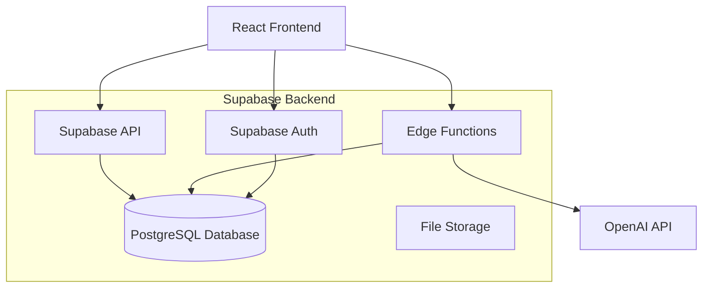
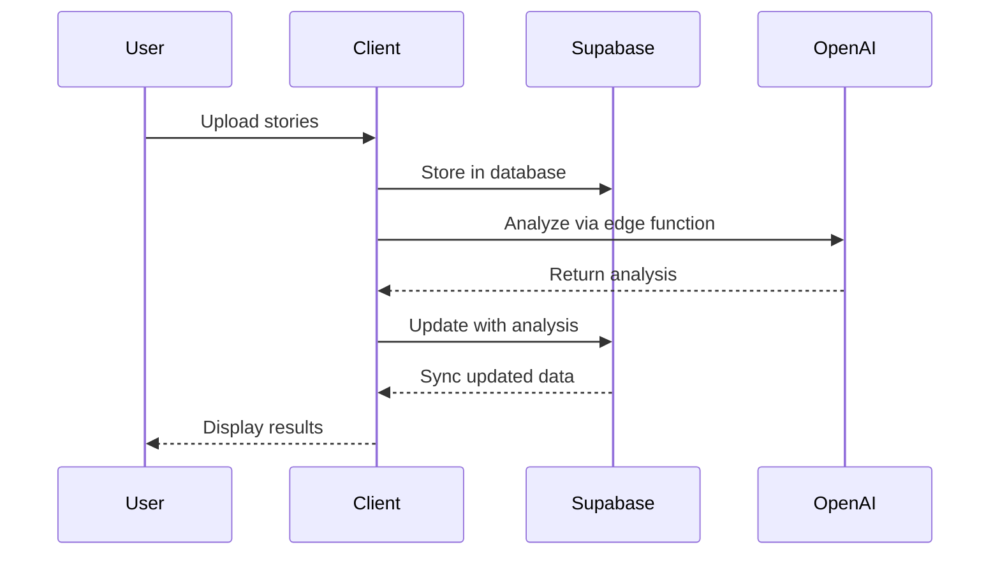
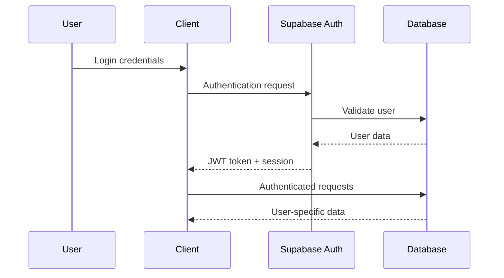

# System Architecture

## Overview

The Interview Story & Job Analysis Platform is built as a modern, scalable web application using React for the frontend and Supabase as the backend-as-a-service platform. The architecture emphasizes security, performance, and maintainability.

## High-Level Architecture



## Frontend Architecture

### Technology Stack
- **React 18**: Modern React with hooks and functional components
- **TypeScript**: Full type safety across the application
- **Vite**: Fast build tool and development server
- **Tailwind CSS**: Utility-first CSS framework with custom design system
- **React Query**: Server state management and caching
- **React Router**: Client-side routing

### Component Architecture

```
Components Hierarchy:
├── App (Root)
├── Layout Components
│   ├── AppNavigation
│   ├── AuthGuard
│   └── UserMenu
├── Page Components
│   ├── LandingPage
│   ├── StoriesPage
│   ├── JobDescriptionsPage
│   ├── InterviewPrepPage
│   └── [other pages]
├── Feature Components
│   ├── StoryManagement
│   ├── InterviewPrepTool
│   ├── JobAnalysisResults
│   └── [other features]
└── UI Components (shadcn/ui)
    ├── Button, Card, Dialog
    └── [other primitives]
```

### State Management Strategy

1. **Server State**: React Query for API data caching and synchronization
2. **Local State**: React hooks (useState, useReducer) for component state
3. **Authentication State**: Custom useAuth hook with Supabase Auth
4. **URL State**: React Router for navigation state

### Custom Hooks

```typescript
// Authentication
useAuth() - User session and auth methods

// Data Fetching
useStoryGroups() - Story data management
useJobDescriptions() - Job analysis data
useBookmarks() - Bookmark management

// UI State
useIframeResize() - Responsive iframe handling
useHeroImage() - Hero image management
```

## Backend Architecture

### Supabase Services

1. **Database**: PostgreSQL with Row-Level Security (RLS)
2. **Authentication**: Built-in user management and JWT tokens
3. **Edge Functions**: Serverless functions for API integrations
4. **Storage**: File uploads and asset management
5. **Real-time**: Live data synchronization (future use)

### Database Schema

#### Core Tables

```sql
-- User data
profiles (user_id, username, full_name, email)
user_roles (user_id, role)

-- Story management
interview_stories (id, user_id, theme, organisation, situation, task, action, result, lesson, framing)
story_tags (story_id, tag_name)
story_bookmarks (user_id, story_id)

-- Job analysis
job_descriptions (id, user_id, title, company, description, extracted_themes)

-- Practice & preparation
practice_sessions (id, user_id, started_at, completed_at)
practice_items (session_id, story_id, confidence_level, is_correct)
user_analytics (user_id, readiness_score, total_sessions)
```

#### Security Model

- **Row-Level Security (RLS)**: Enabled on all user data tables
- **User Isolation**: Users can only access their own data
- **Role-Based Access**: Admin roles for configuration access
- **API Security**: JWT validation on all authenticated endpoints

### Edge Functions

Located in `supabase/functions/`:

1. **analyze-story**: 
   - Processes individual stories with OpenAI
   - Extracts themes and provides optimization suggestions
   - Returns quality scores and improvement recommendations

2. **analyze-job-description**:
   - Analyzes job posting content
   - Extracts key requirements and themes
   - Matches against user's story database

3. **bulk-analyze-stories**:
   - Processes multiple stories in batch
   - Optimizes API usage with batching
   - Handles large dataset imports

#### Function Architecture

```typescript
// Standard edge function structure
export default async function handler(req: Request) {
  // CORS handling
  if (req.method === 'OPTIONS') {
    return new Response(null, { headers: corsHeaders });
  }
  
  // Authentication check
  const authHeader = req.headers.get('authorization');
  const { user } = await getUser(authHeader);
  
  // Business logic
  const result = await processRequest(data, user);
  
  // Response with CORS
  return new Response(JSON.stringify(result), {
    headers: { ...corsHeaders, 'Content-Type': 'application/json' }
  });
}
```

## Data Flow

### Story Management Flow



### Authentication Flow



## Security Architecture

### Authentication & Authorization

1. **JWT Tokens**: Supabase-issued tokens for API access
2. **Row-Level Security**: Database-level access control
3. **Role-Based Permissions**: Admin/user role separation
4. **API Key Management**: Secure storage in Supabase secrets

### Data Protection

1. **Input Validation**: Client and server-side validation
2. **SQL Injection Prevention**: Parameterized queries only
3. **XSS Protection**: Content sanitization
4. **CORS Configuration**: Proper cross-origin resource sharing

### Privacy Measures

1. **Data Encryption**: At-rest and in-transit encryption
2. **User Data Isolation**: RLS ensures user privacy
3. **Audit Logging**: Activity tracking for compliance
4. **Data Retention**: Configurable retention policies

## Performance Considerations

### Frontend Optimization

1. **Code Splitting**: Route-based lazy loading
2. **Component Memoization**: React.memo for expensive components
3. **Query Optimization**: React Query caching and background updates
4. **Asset Optimization**: Image lazy loading and compression

### Backend Optimization

1. **Database Indexing**: Optimized queries with proper indexes
2. **Connection Pooling**: Efficient database connections
3. **Edge Function Caching**: Response caching where appropriate
4. **Batch Processing**: Bulk operations for data imports

## Scalability Considerations

### Horizontal Scaling

1. **Stateless Design**: Functions don't maintain state
2. **Database Scaling**: Supabase handles database scaling
3. **CDN Integration**: Static asset distribution
4. **Caching Strategy**: Multi-level caching implementation

### Monitoring & Observability

1. **Error Tracking**: Comprehensive error logging
2. **Performance Monitoring**: API response time tracking
3. **User Analytics**: Usage pattern analysis
4. **Health Checks**: System health monitoring

## Development Workflow

### Local Development

1. **Environment Setup**: Local Supabase instance optional
2. **Hot Reloading**: Vite dev server for fast feedback
3. **Type Generation**: Automatic TypeScript types from schema
4. **Testing Strategy**: Unit and integration tests

### Deployment Pipeline

1. **Version Control**: Git-based workflow
2. **Continuous Integration**: Automated testing and building
3. **Database Migrations**: Version-controlled schema changes
4. **Environment Promotion**: Dev → Staging → Production

## Future Architecture Considerations

### Planned Enhancements

1. **Microservices**: Potential service decomposition
2. **Real-time Features**: WebSocket integration
3. **Mobile Apps**: React Native implementation
4. **AI/ML Pipeline**: Enhanced recommendation engine
5. **Analytics Platform**: Advanced usage analytics

### Technology Roadmap

1. **Performance**: Advanced caching strategies
2. **Security**: Enhanced audit and compliance features
3. **Integration**: Third-party service connections
4. **Scalability**: Multi-region deployment support